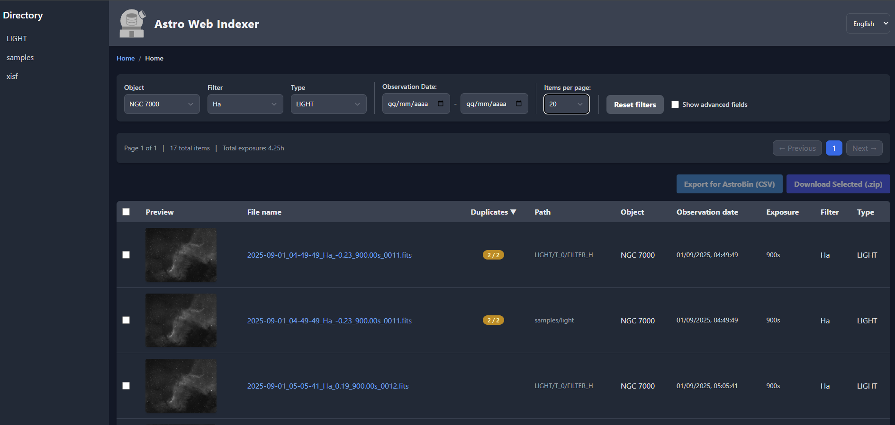

# Astro Web Indexer

[](https://www.gnu.org/licenses/gpl-3.0)

A web-based FITS file indexer and viewer for astronomical data, designed specifically for astronomical observatories and research institutions. This tool helps organize, browse, and analyze FITS (Flexible Image Transport System) files through an intuitive web interface.

## Project Status

**Beta Phase:** This project has been tested in a very limited environment and for a single use case. It should be considered in the beta phase. We appreciate any feedback and contributions to improve its stability and features.

## Preview


## Features

### Core Functionality
- 📁 Browse and search FITS files in a directory structure
- 🔄 Real-time monitoring and automatic indexing of new files
- 🖼️ Built-in preview support for FITS images
- 🔍 Advanced filtering by object, filter type, and image type
- 📥 Bulk download functionality with ZIP compression

### User Experience
- 🌐 Multilingual interface (English, Italian, French, Spanish, and German)
- 📱 Responsive design for mobile and desktop
- 🎨 Modern, dark-themed interface
- ⚡ Fast and efficient file browsing

### Technical Features
- 🐳 Dockerized deployment for easy setup
- 🗄️ MariaDB backend for robust data storage
- 🔒 Secure file handling and access control
- 📊 FITS header metadata extraction and indexing

## Requirements

- Docker
- Docker Compose

## Quick Start

1. Clone the repository:
```bash
git clone https://github.com/yourusername/astro-web-indexer.git
cd astro-web-indexer
```

2. Copy the example environment file and adjust as needed:
```bash
cp .env.example .env
```

3. Create the data directory for your FITS files:
```bash
mkdir -p data/fits
```

4. Start the application:
```bash
docker-compose up -d
```

5. Access the application at http://localhost:2080

## Configuration

All configuration can be done through environment variables. See `.env.example` for available options.

### Environment Variables

| Variable | Description | Default |
|----------|-------------|---------|
| NGINX_PORT | The port to expose the web interface | 2080 |
| HEADER_TITLE | The title shown in the header | Astro Web Indexer |
| FITS_DATA_PATH | Path to FITS files directory | ./data/fits |
| ENABLE_FITS_WATCHER | Enable automatic file indexing | true |
| DB_* | Database connection settings | See .env.example |

## Directory Structure

```
astro-web-indexer/
├── docker/                    # Docker configuration files
├── src/                      # Application source code
├── scripts/                  # Utility scripts
└── tests/                    # Test files
```

## Contributing

We welcome contributions! Here's how you can help:

1. 🍴 Fork the repository
2. 🌿 Create a feature branch: `git checkout -b feature/my-feature`
3. 💾 Commit your changes: `git commit -am 'Add: my feature'`
4. ⤴️ Push to the branch: `git push origin feature/my-feature`
5. 🔍 Submit a pull request

### Bug Reports
Please use the GitHub issue tracker and include:
- Detailed description of the issue
- Steps to reproduce
- Expected vs actual behavior
- Environment details

## License

This project is licensed under the GNU General Public License v3.0 - see the [LICENSE](LICENSE) file for details.

